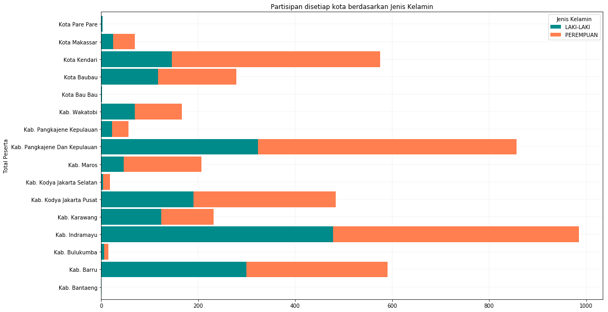

```python
import pandas as pd
import time
import matplotlib.pyplot as plt
from datetime import date, datetime
from itertools import cycle, islice
from IPython.core.interactiveshell import InteractiveShell
```


```python
InteractiveShell.ast_node_interactivity = "all"
timestr = time.strftime("%Y%m%d-%H%M")
pd.options.display.max_rows = 1000
```


```python
registration = pd.read_excel('./data/DATA_CLEANING-35990002.xlsx', skiprows=[0])
participation = pd.read_excel('./data/DATA_CLEANING-44030001.xlsx', skiprows=[0])
```


```python
regs = registration[[
    'Identifier',
    '41480001|Nama Lengkap (Sesuai KTP/Kartu Pelajar)',
    '44020003|Tanggal Lahir',
    '47000004|Jenis Kelamin',
    '43440001|Alamat'
]]
pcs = participation[[
    'Identifier',
    '41480002|Daftar Kode Output-Aktifitas (Pastikan ke penyelenggara)',
    '36970009|Nama Aktifitas (lihat absensi kertas/backdrop kegiatan)',
    '40580002|Organisasi penyelenggara',
    '40550002|Tanggal Aktifitas (tanggal mulai)',
]]
youth_participation = pd.merge(pcs, regs, on='Identifier')
youth_participation = youth_participation.rename(columns = {
    '41480002|Daftar Kode Output-Aktifitas (Pastikan ke penyelenggara)':'Kode Output',
    '36970009|Nama Aktifitas (lihat absensi kertas/backdrop kegiatan)':'Nama Aktivitas',
    '40580002|Organisasi penyelenggara':'Organisasi Penyelenggara',
    '40550002|Tanggal Aktifitas (tanggal mulai)':'Tanggal Aktivitas',
    '41480001|Nama Lengkap (Sesuai KTP/Kartu Pelajar)':'Nama Lengkap',
    '44020003|Tanggal Lahir':'DOB',
    '47000004|Jenis Kelamin':'Jenis Kelamin',
    '43440001|Alamat':'Alamat',
})
youth_participation['Goal Code'] = youth_participation['Kode Output'].apply(lambda x: x.split('|')[3][:7])
youth_participation['Nama Aktivitas'] = youth_participation['Nama Aktivitas'].apply(lambda x: x.title())
youth_participation['Jenis Kelamin'] = youth_participation['Jenis Kelamin'].apply(lambda x:x.upper())
youth_participation['Provinsi'] = youth_participation['Alamat'].apply(lambda x:x.split('|')[0].replace('Prov. ',''))
youth_participation['Kota / Kab'] = youth_participation['Alamat'].apply(lambda x:x.split('|')[1])
youth_participation['Nama Lengkap'] = youth_participation['Nama Lengkap'].apply(lambda x:x.title())
youth_participation['DOB'] = youth_participation['DOB'].fillna(0)
```


```python
def calculateAge(born):
    born = datetime.strptime(born, "%Y-%m-%d").date()
    today = date.today()
    age = today.year - born.year - ((today.month, today.day) < (born.month, born.day))
    if age < 15:
        return '< 15'
    elif 15 <= age <=29:
        return '15 - 29'
    else:
        return '29 >'
```


```python
youth_participation['Umur'] = youth_participation['DOB'].apply(lambda x: None if x == 0 else calculateAge(x))
```


```python
graph = youth_participation.groupby(['Goal Code','Organisasi Penyelenggara']).size().unstack()
colors = list(islice(cycle(['darkcyan', 'orange', 'slateblue', 'green']), None, len(graph)))
graph = graph.plot(kind='barh', stacked=True, figsize=(17, 10), zorder=2, width=.9, color=colors)
graph.grid(zorder=1, linestyle='-', linewidth=.3, alpha=.5)
graph.set_title('Partisipan disetiap kota berdasarkan Organisasi Penyelenggara dan Goal Code')
graph.set_ylabel('Goal Code')
graph.set_xlabel('Total Peserta')
```


    Text(0.5,1,'Partisipan disetiap kota berdasarkan Organisasi Penyelenggara dan Goal Code')


    Text(0,0.5,'Goal Code')


    Text(0.5,0,'Total Peserta')


```python
graph = youth_participation.groupby(['Goal Code','Jenis Kelamin']).size().unstack()
colors = list(islice(cycle(['darkcyan', 'coral']), None, len(graph)))
graph = graph.plot(kind='barh', stacked=True, figsize=(17, 10), zorder=2, width=.9, color=colors)
graph.grid(zorder=1, linestyle='-', linewidth=.3, alpha=.5)
graph.set_title('Partisipan disetiap kota berdasarkan Jenis Kelamin dan Goal Code')
graph.set_ylabel('Goal Code')
graph.set_xlabel('Total Peserta')
```


    Text(0.5,1,'Partisipan disetiap kota berdasarkan Jenis Kelamin dan Goal Code')


    Text(0,0.5,'Goal Code')


    Text(0.5,0,'Total Peserta')


```python
graph = youth_participation.groupby(['Kota / Kab','Jenis Kelamin']).size().unstack()
colors = list(islice(cycle(['darkcyan', 'coral']), None, len(graph)))
graph = graph.plot(kind='barh', stacked=True, figsize=(17, 10), zorder=2, width=.9, color=colors)
graph.grid(zorder=1, linestyle='-', linewidth=.3, alpha=.5)
graph.set_title('Partisipan disetiap kota berdasarkan Jenis Kelamin')
graph.set_ylabel('Propinsi')
graph.set_ylabel('Total Peserta')
```


    Text(0.5,1,'Partisipan disetiap kota berdasarkan Jenis Kelamin')


    Text(0,0.5,'Propinsi')


    Text(0,0.5,'Total Peserta')





```python
group_names=['DKI Jakarta','Jawa Barat','Sulawesi Selatan','Sulawesi Tenggara']
group_size=youth_participation.groupby(['Provinsi']).size()
subgroup_names=['Laki-Laki','Perempuan']
subgroup_size=youth_participation.groupby(['Jenis Kelamin']).size()
 
fig, ax = plt.subplots()
ax.axis('equal')
mypie, _ = ax.pie(group_size, radius=1, labels=group_names, colors=['slateblue', 'tomato', 'orange', 'forestgreen'])
plt.setp( mypie, width=0.4, edgecolor='white')
 
mypie2, _ = ax.pie(subgroup_size, radius=0.6, labels=subgroup_names, labeldistance=0.7, colors=['darkcyan', 'coral'])
plt.setp( mypie2, width=0.3, edgecolor='white')
plt.title('Seluruh Aktivitas berdasarkan Jenis Kelamin')
plt.show()
```


    (-0.05500000000000001,
     0.05500000000000001,
     -0.05500000000000001,
     0.05500000000000001)


    [None, None, None, None, None, None, None, None]


    [None, None, None, None]


    Text(0.5,1,'Seluruh Aktivitas berdasarkan Jenis Kelamin')


```python
print('\nSeluruh Partisipan Aktivitas dengan Goal Code 1.1.1.1 berdasarkan Jenis Kelamin')
youth_participation.loc[youth_participation['Goal Code'] == '1.1.1.1'].groupby(['Jenis Kelamin']).size().to_frame('Peserta').reset_index()

print('\nSeluruh Partisipan Aktivitas dengan Goal Code 1.1.1.1 berdasarkan Usia')
youth_participation.loc[youth_participation['Goal Code'] == '1.1.1.1'].groupby(['Umur']).size().to_frame('Peserta').reset_index()

print('\nSeluruh Peserta yang Hadir di Workshop Video Berdasarkan Umur')
youth_participation.loc[youth_participation['Nama Aktivitas'].str.contains('Video')].groupby(['Umur']).size().to_frame('Peserta').reset_index()

print('\nSeluruh Peserta yang Hadir di Workshop Video')
youth_participation.loc[youth_participation['Nama Aktivitas'].str.contains('Video')].groupby(['Kota / Kab']).size().to_frame('Peserta').reset_index()

print('\nSeluruh Partisipan Aktivitas dengan Goal Code 1.1.1.1 berdasarkan Nama Aktivitas')
youth_participation.loc[youth_participation['Goal Code'] == '1.1.1.1'].groupby(['Nama Aktivitas']).size().to_frame('Peserta').reset_index()
```

    
    Seluruh Partisipan Aktivitas dengan Goal Code 1.1.1.1 berdasarkan Jenis Kelamin


<div>
<style scoped>
    .dataframe tbody tr th:only-of-type {
        vertical-align: middle;
    }

    .dataframe tbody tr th {
        vertical-align: top;
    }

    .dataframe thead th {
        text-align: right;
    }
</style>
<table border="1" class="dataframe">
  <thead>
    <tr style="text-align: right;">
      <th></th>
      <th>Jenis Kelamin</th>
      <th>Peserta</th>
    </tr>
  </thead>
  <tbody>
    <tr>
      <th>0</th>
      <td>LAKI-LAKI</td>
      <td>391</td>
    </tr>
    <tr>
      <th>1</th>
      <td>PEREMPUAN</td>
      <td>593</td>
    </tr>
  </tbody>
</table>
</div>


    
    Seluruh Partisipan Aktivitas dengan Goal Code 1.1.1.1 berdasarkan Usia


<div>
<style scoped>
    .dataframe tbody tr th:only-of-type {
        vertical-align: middle;
    }

    .dataframe tbody tr th {
        vertical-align: top;
    }

    .dataframe thead th {
        text-align: right;
    }
</style>
<table border="1" class="dataframe">
  <thead>
    <tr style="text-align: right;">
      <th></th>
      <th>Umur</th>
      <th>Peserta</th>
    </tr>
  </thead>
  <tbody>
    <tr>
      <th>0</th>
      <td>15 - 29</td>
      <td>855</td>
    </tr>
    <tr>
      <th>1</th>
      <td>29 &gt;</td>
      <td>39</td>
    </tr>
    <tr>
      <th>2</th>
      <td>&lt; 15</td>
      <td>43</td>
    </tr>
  </tbody>
</table>
</div>


    
    Seluruh Peserta yang Hadir di Workshop Video Berdasarkan Umur


<div>
<style scoped>
    .dataframe tbody tr th:only-of-type {
        vertical-align: middle;
    }

    .dataframe tbody tr th {
        vertical-align: top;
    }

    .dataframe thead th {
        text-align: right;
    }
</style>
<table border="1" class="dataframe">
  <thead>
    <tr style="text-align: right;">
      <th></th>
      <th>Umur</th>
      <th>Peserta</th>
    </tr>
  </thead>
  <tbody>
    <tr>
      <th>0</th>
      <td>15 - 29</td>
      <td>126</td>
    </tr>
    <tr>
      <th>1</th>
      <td>29 &gt;</td>
      <td>1</td>
    </tr>
    <tr>
      <th>2</th>
      <td>&lt; 15</td>
      <td>8</td>
    </tr>
  </tbody>
</table>
</div>


    
    Seluruh Peserta yang Hadir di Workshop Video


<div>
<style scoped>
    .dataframe tbody tr th:only-of-type {
        vertical-align: middle;
    }

    .dataframe tbody tr th {
        vertical-align: top;
    }

    .dataframe thead th {
        text-align: right;
    }
</style>
<table border="1" class="dataframe">
  <thead>
    <tr style="text-align: right;">
      <th></th>
      <th>Kota / Kab</th>
      <th>Peserta</th>
    </tr>
  </thead>
  <tbody>
    <tr>
      <th>0</th>
      <td>Kab. Indramayu</td>
      <td>78</td>
    </tr>
    <tr>
      <th>1</th>
      <td>Kota Kendari</td>
      <td>57</td>
    </tr>
  </tbody>
</table>
</div>


    
    Seluruh Partisipan Aktivitas dengan Goal Code 1.1.1.1 berdasarkan Nama Aktivitas


<div>
<style scoped>
    .dataframe tbody tr th:only-of-type {
        vertical-align: middle;
    }

    .dataframe tbody tr th {
        vertical-align: top;
    }

    .dataframe thead th {
        text-align: right;
    }
</style>
<table border="1" class="dataframe">
  <thead>
    <tr style="text-align: right;">
      <th></th>
      <th>Nama Aktivitas</th>
      <th>Peserta</th>
    </tr>
  </thead>
  <tbody>
    <tr>
      <th>0</th>
      <td>Assesment</td>
      <td>27</td>
    </tr>
    <tr>
      <th>1</th>
      <td>Assesment Di Baubau</td>
      <td>2</td>
    </tr>
    <tr>
      <th>2</th>
      <td>Assesment Struktur Youth Hub</td>
      <td>2</td>
    </tr>
    <tr>
      <th>3</th>
      <td>Assessment</td>
      <td>20</td>
    </tr>
    <tr>
      <th>4</th>
      <td>Assessment 2 Lowu-Lowu</td>
      <td>8</td>
    </tr>
    <tr>
      <th>5</th>
      <td>Diskusi Youth Hub (Core Team)</td>
      <td>12</td>
    </tr>
    <tr>
      <th>6</th>
      <td>Fgd</td>
      <td>109</td>
    </tr>
    <tr>
      <th>7</th>
      <td>Fgd Dan Tes Akvo Flow</td>
      <td>2</td>
    </tr>
    <tr>
      <th>8</th>
      <td>Fgd Dan Test Akvo Flow</td>
      <td>2</td>
    </tr>
    <tr>
      <th>9</th>
      <td>Fgd Dengan Anak-Anak Sma/Smk Baubau</td>
      <td>1</td>
    </tr>
    <tr>
      <th>10</th>
      <td>Fgd Dengan Anak-Anak Sma/Smk Di Baubau</td>
      <td>4</td>
    </tr>
    <tr>
      <th>11</th>
      <td>Kegiatan Fgd Di Kel. Batulo Kota Baubau</td>
      <td>7</td>
    </tr>
    <tr>
      <th>12</th>
      <td>Kelas Keliling Tik Indramayu</td>
      <td>3</td>
    </tr>
    <tr>
      <th>13</th>
      <td>Kelas Keliling Tik Kendari</td>
      <td>1</td>
    </tr>
    <tr>
      <th>14</th>
      <td>Meeting With Community</td>
      <td>11</td>
    </tr>
    <tr>
      <th>15</th>
      <td>Meeting With Youth</td>
      <td>24</td>
    </tr>
    <tr>
      <th>16</th>
      <td>Meeting With Youth In Lasitae</td>
      <td>10</td>
    </tr>
    <tr>
      <th>17</th>
      <td>Pelatihan Hcd Youth Hub</td>
      <td>14</td>
    </tr>
    <tr>
      <th>18</th>
      <td>Peluncuran Youth Hub</td>
      <td>32</td>
    </tr>
    <tr>
      <th>19</th>
      <td>Peluncuran Youth Hub Krd</td>
      <td>10</td>
    </tr>
    <tr>
      <th>20</th>
      <td>Pemantapan Youth Hub</td>
      <td>16</td>
    </tr>
    <tr>
      <th>21</th>
      <td>Pengenalan Program Eyw</td>
      <td>8</td>
    </tr>
    <tr>
      <th>22</th>
      <td>Perkenalan Program Eyw</td>
      <td>4</td>
    </tr>
    <tr>
      <th>23</th>
      <td>Persiapan Mapping</td>
      <td>1</td>
    </tr>
    <tr>
      <th>24</th>
      <td>Persiapan Pembentukan Youth Hub</td>
      <td>30</td>
    </tr>
    <tr>
      <th>25</th>
      <td>Persiapan Pembukaan Yout Hub</td>
      <td>39</td>
    </tr>
    <tr>
      <th>26</th>
      <td>Persiapan Sosialisasi</td>
      <td>6</td>
    </tr>
    <tr>
      <th>27</th>
      <td>Pertemuan Anak Muda - Sosialisasi Youth Hub</td>
      <td>249</td>
    </tr>
    <tr>
      <th>28</th>
      <td>Pertemuan Anak Muda Barru</td>
      <td>36</td>
    </tr>
    <tr>
      <th>29</th>
      <td>Pertemuan Anak Muda Desa Lasitae</td>
      <td>10</td>
    </tr>
    <tr>
      <th>30</th>
      <td>Pertemuan Orang Tua Terkait Youth Hub</td>
      <td>6</td>
    </tr>
    <tr>
      <th>31</th>
      <td>Sosialisasi / Koordinasi Anak Muda Desa Boddie</td>
      <td>15</td>
    </tr>
    <tr>
      <th>32</th>
      <td>Sosialisasi / Koordinasi Anak Muda Kel. Bontoa</td>
      <td>1</td>
    </tr>
    <tr>
      <th>33</th>
      <td>Sosialisasi / Koordinasi Anak Muda Kelurahan B...</td>
      <td>36</td>
    </tr>
    <tr>
      <th>34</th>
      <td>Sosialisasi Awal Desa Pancana</td>
      <td>10</td>
    </tr>
    <tr>
      <th>35</th>
      <td>Sosialisasi Awal Desa Siddo</td>
      <td>7</td>
    </tr>
    <tr>
      <th>36</th>
      <td>Sosialisasi Eyw</td>
      <td>10</td>
    </tr>
    <tr>
      <th>37</th>
      <td>Sosialisasi Eyw Desa Madello</td>
      <td>15</td>
    </tr>
    <tr>
      <th>38</th>
      <td>Sosialisasi Eyw Desa Pundata Baji</td>
      <td>12</td>
    </tr>
    <tr>
      <th>39</th>
      <td>Sosialisasi Kelurahan Borimasunggu</td>
      <td>4</td>
    </tr>
    <tr>
      <th>40</th>
      <td>Sosialisasi Youth Hub Borimasunggu</td>
      <td>10</td>
    </tr>
    <tr>
      <th>41</th>
      <td>Tindak Lanjut Mou Di Batulo</td>
      <td>2</td>
    </tr>
    <tr>
      <th>42</th>
      <td>Tindak Lanjut Mou Yh Di Batulo</td>
      <td>1</td>
    </tr>
    <tr>
      <th>43</th>
      <td>Training Fasilitasi Set Up Youth Hub</td>
      <td>6</td>
    </tr>
    <tr>
      <th>44</th>
      <td>Training Hcd</td>
      <td>1</td>
    </tr>
    <tr>
      <th>45</th>
      <td>Training Hcd Di Kel. Lowu-Lowu</td>
      <td>12</td>
    </tr>
    <tr>
      <th>46</th>
      <td>Training Hcd Kel. Lowu-Lowu</td>
      <td>1</td>
    </tr>
    <tr>
      <th>47</th>
      <td>Training Hcd Kelurahan Pundata Baji Dan Kelura...</td>
      <td>12</td>
    </tr>
    <tr>
      <th>48</th>
      <td>Training Hcd Persiapan Youth Hub</td>
      <td>21</td>
    </tr>
    <tr>
      <th>49</th>
      <td>Training Hcd Persiapan Youth Hub Desa Siddo</td>
      <td>3</td>
    </tr>
    <tr>
      <th>50</th>
      <td>Training Hcd Tools Dusun Pute Angin</td>
      <td>20</td>
    </tr>
    <tr>
      <th>51</th>
      <td>Training Hcd Untuk Pembentukan Youth Hub</td>
      <td>17</td>
    </tr>
    <tr>
      <th>52</th>
      <td>Training Hcd Youth Hub</td>
      <td>24</td>
    </tr>
    <tr>
      <th>53</th>
      <td>Training Perjalanan Impian Persiapan Youth Hub</td>
      <td>20</td>
    </tr>
    <tr>
      <th>54</th>
      <td>Workshop Co Creation Youth And Training Hcd</td>
      <td>16</td>
    </tr>
    <tr>
      <th>55</th>
      <td>Workshop Gals Peta Relasi</td>
      <td>2</td>
    </tr>
  </tbody>
</table>
</div>


```python
print('\nSeluruh Partisipan Aktivitas dengan Goal Code 1.1.2 berdasarkan Jenis Kelamin')
youth_participation.loc[youth_participation['Goal Code'].str.contains('1.1.2')].groupby(['Jenis Kelamin']).size().to_frame('Peserta').reset_index()

print('\nSeluruh Partisipan Aktivitas dengan Goal Code 1.1.2 berdasarkan Usia')
youth_participation.loc[youth_participation['Goal Code'].str.contains('1.1.2')].groupby(['Umur']).size().to_frame('Peserta').reset_index()

print('\nSeluruh Peserta yang Hadir di Workshop Video Berdasarkan Umur')
youth_participation.loc[youth_participation['Nama Aktivitas'].str.contains('Video')].groupby(['Umur']).size().to_frame('Peserta').reset_index()

print('\nSeluruh Peserta yang Hadir di Workshop Video')
youth_participation.loc[youth_participation['Nama Aktivitas'].str.contains('Video')].groupby(['Kota / Kab']).size().to_frame('Peserta').reset_index()

print('\nSeluruh Partisipan Aktivitas dengan Goal Code 1.1.2 berdasarkan Nama Aktivitas')
youth_participation.loc[youth_participation['Goal Code'].str.contains('1.1.2')].groupby(['Nama Aktivitas']).size().to_frame('Peserta').reset_index()
```

    
    Seluruh Partisipan Aktivitas dengan Goal Code 1.1.2 berdasarkan Jenis Kelamin


<div>
<style scoped>
    .dataframe tbody tr th:only-of-type {
        vertical-align: middle;
    }

    .dataframe tbody tr th {
        vertical-align: top;
    }

    .dataframe thead th {
        text-align: right;
    }
</style>
<table border="1" class="dataframe">
  <thead>
    <tr style="text-align: right;">
      <th></th>
      <th>Jenis Kelamin</th>
      <th>Peserta</th>
    </tr>
  </thead>
  <tbody>
    <tr>
      <th>0</th>
      <td>LAKI-LAKI</td>
      <td>521</td>
    </tr>
    <tr>
      <th>1</th>
      <td>PEREMPUAN</td>
      <td>882</td>
    </tr>
  </tbody>
</table>
</div>


    
    Seluruh Partisipan Aktivitas dengan Goal Code 1.1.2 berdasarkan Usia


<div>
<style scoped>
    .dataframe tbody tr th:only-of-type {
        vertical-align: middle;
    }

    .dataframe tbody tr th {
        vertical-align: top;
    }

    .dataframe thead th {
        text-align: right;
    }
</style>
<table border="1" class="dataframe">
  <thead>
    <tr style="text-align: right;">
      <th></th>
      <th>Umur</th>
      <th>Peserta</th>
    </tr>
  </thead>
  <tbody>
    <tr>
      <th>0</th>
      <td>15 - 29</td>
      <td>1160</td>
    </tr>
    <tr>
      <th>1</th>
      <td>29 &gt;</td>
      <td>119</td>
    </tr>
    <tr>
      <th>2</th>
      <td>&lt; 15</td>
      <td>117</td>
    </tr>
  </tbody>
</table>
</div>


    
    Seluruh Peserta yang Hadir di Workshop Video Berdasarkan Umur


<div>
<style scoped>
    .dataframe tbody tr th:only-of-type {
        vertical-align: middle;
    }

    .dataframe tbody tr th {
        vertical-align: top;
    }

    .dataframe thead th {
        text-align: right;
    }
</style>
<table border="1" class="dataframe">
  <thead>
    <tr style="text-align: right;">
      <th></th>
      <th>Umur</th>
      <th>Peserta</th>
    </tr>
  </thead>
  <tbody>
    <tr>
      <th>0</th>
      <td>15 - 29</td>
      <td>126</td>
    </tr>
    <tr>
      <th>1</th>
      <td>29 &gt;</td>
      <td>1</td>
    </tr>
    <tr>
      <th>2</th>
      <td>&lt; 15</td>
      <td>8</td>
    </tr>
  </tbody>
</table>
</div>


    
    Seluruh Peserta yang Hadir di Workshop Video


<div>
<style scoped>
    .dataframe tbody tr th:only-of-type {
        vertical-align: middle;
    }

    .dataframe tbody tr th {
        vertical-align: top;
    }

    .dataframe thead th {
        text-align: right;
    }
</style>
<table border="1" class="dataframe">
  <thead>
    <tr style="text-align: right;">
      <th></th>
      <th>Kota / Kab</th>
      <th>Peserta</th>
    </tr>
  </thead>
  <tbody>
    <tr>
      <th>0</th>
      <td>Kab. Indramayu</td>
      <td>78</td>
    </tr>
    <tr>
      <th>1</th>
      <td>Kota Kendari</td>
      <td>57</td>
    </tr>
  </tbody>
</table>
</div>


    
    Seluruh Partisipan Aktivitas dengan Goal Code 1.1.2 berdasarkan Nama Aktivitas


<div>
<style scoped>
    .dataframe tbody tr th:only-of-type {
        vertical-align: middle;
    }

    .dataframe tbody tr th {
        vertical-align: top;
    }

    .dataframe thead th {
        text-align: right;
    }
</style>
<table border="1" class="dataframe">
  <thead>
    <tr style="text-align: right;">
      <th></th>
      <th>Nama Aktivitas</th>
      <th>Peserta</th>
    </tr>
  </thead>
  <tbody>
    <tr>
      <th>0</th>
      <td>Community Action Learning</td>
      <td>2</td>
    </tr>
    <tr>
      <th>1</th>
      <td>Diskusi Hcd</td>
      <td>14</td>
    </tr>
    <tr>
      <th>2</th>
      <td>Field Visit Mith Richard And Eyw Team</td>
      <td>1</td>
    </tr>
    <tr>
      <th>3</th>
      <td>Field Visit With Richard And Eyw Team</td>
      <td>1</td>
    </tr>
    <tr>
      <th>4</th>
      <td>Field Visit With Ridchard And Eyw Team</td>
      <td>5</td>
    </tr>
    <tr>
      <th>5</th>
      <td>Field Visit With Rideard And Eyw Team</td>
      <td>1</td>
    </tr>
    <tr>
      <th>6</th>
      <td>Gals Adaptation And Tot Workshop</td>
      <td>1</td>
    </tr>
    <tr>
      <th>7</th>
      <td>Hcd</td>
      <td>1</td>
    </tr>
    <tr>
      <th>8</th>
      <td>Hcd Training</td>
      <td>8</td>
    </tr>
    <tr>
      <th>9</th>
      <td>Hcd Training &amp; Gals</td>
      <td>1</td>
    </tr>
    <tr>
      <th>10</th>
      <td>Kelas Keiling Tik Kendari</td>
      <td>1</td>
    </tr>
    <tr>
      <th>11</th>
      <td>Kelas Keliling Kendari</td>
      <td>3</td>
    </tr>
    <tr>
      <th>12</th>
      <td>Kelas Keliling Tiik Kendari</td>
      <td>1</td>
    </tr>
    <tr>
      <th>13</th>
      <td>Kelas Keliling Tik Indramayu</td>
      <td>368</td>
    </tr>
    <tr>
      <th>14</th>
      <td>Kelas Keliling Tik Kendari</td>
      <td>466</td>
    </tr>
    <tr>
      <th>15</th>
      <td>Kelas Kelling Tik Kendari</td>
      <td>1</td>
    </tr>
    <tr>
      <th>16</th>
      <td>Kelas Tik Maros</td>
      <td>99</td>
    </tr>
    <tr>
      <th>17</th>
      <td>Launching Youth Hub</td>
      <td>16</td>
    </tr>
    <tr>
      <th>18</th>
      <td>Meeting Whit Youts For Defelopry Youth Hub</td>
      <td>3</td>
    </tr>
    <tr>
      <th>19</th>
      <td>Meeting Whit Youts For Product Assesment</td>
      <td>4</td>
    </tr>
    <tr>
      <th>20</th>
      <td>Meeting Youth Hub Core Team</td>
      <td>5</td>
    </tr>
    <tr>
      <th>21</th>
      <td>Monitoring Gls</td>
      <td>10</td>
    </tr>
    <tr>
      <th>22</th>
      <td>Pancana</td>
      <td>2</td>
    </tr>
    <tr>
      <th>23</th>
      <td>Pelatihan Video Indramayu</td>
      <td>78</td>
    </tr>
    <tr>
      <th>24</th>
      <td>Peluncuran Youth Hub</td>
      <td>34</td>
    </tr>
    <tr>
      <th>25</th>
      <td>Pembukaan Youth Hub Bjps</td>
      <td>1</td>
    </tr>
    <tr>
      <th>26</th>
      <td>Pembukaan Youth Hub Bpjs</td>
      <td>29</td>
    </tr>
    <tr>
      <th>27</th>
      <td>Pertemuan Anak Muda Persiapan Organisasi</td>
      <td>1</td>
    </tr>
    <tr>
      <th>28</th>
      <td>Pertemuan Core Team Youth Hub</td>
      <td>8</td>
    </tr>
    <tr>
      <th>29</th>
      <td>Pertemuan Dengan Youth Hub Krd</td>
      <td>7</td>
    </tr>
    <tr>
      <th>30</th>
      <td>Pertemuan Youth Hub &amp; Community</td>
      <td>3</td>
    </tr>
    <tr>
      <th>31</th>
      <td>Research &amp; Assessment Eyw Youth Hub</td>
      <td>9</td>
    </tr>
    <tr>
      <th>32</th>
      <td>Sosialisasi</td>
      <td>12</td>
    </tr>
    <tr>
      <th>33</th>
      <td>Sosialisasi Awal - Dusun Putiangin</td>
      <td>1</td>
    </tr>
    <tr>
      <th>34</th>
      <td>Sosialisasi Awal Kelurahan Borimasunggu Kab Pa...</td>
      <td>5</td>
    </tr>
    <tr>
      <th>35</th>
      <td>Sosialisasi Awal Kelurahan Borimasunggu Kab.Pa...</td>
      <td>1</td>
    </tr>
    <tr>
      <th>36</th>
      <td>Sosialisasi Pertemuan Kedua</td>
      <td>1</td>
    </tr>
    <tr>
      <th>37</th>
      <td>Sosialisasi With Youth Hub</td>
      <td>3</td>
    </tr>
    <tr>
      <th>38</th>
      <td>Sosialisasi Youth Hub</td>
      <td>97</td>
    </tr>
    <tr>
      <th>39</th>
      <td>Sosialisasisosialisasi Youth Hub</td>
      <td>1</td>
    </tr>
    <tr>
      <th>40</th>
      <td>Sosialosasi</td>
      <td>1</td>
    </tr>
    <tr>
      <th>41</th>
      <td>Training Fasilitasi Set Up Youth Hub</td>
      <td>19</td>
    </tr>
    <tr>
      <th>42</th>
      <td>Training Hrd Tools</td>
      <td>2</td>
    </tr>
    <tr>
      <th>43</th>
      <td>Training Youth Rep Wakatobi</td>
      <td>1</td>
    </tr>
    <tr>
      <th>44</th>
      <td>User Testing Akvo</td>
      <td>4</td>
    </tr>
    <tr>
      <th>45</th>
      <td>User Testing Sulawesi Selatan</td>
      <td>5</td>
    </tr>
    <tr>
      <th>46</th>
      <td>Worksbop Video Kendari</td>
      <td>1</td>
    </tr>
    <tr>
      <th>47</th>
      <td>Workshop Meraih Puluhan Juta Dengan Online Mar...</td>
      <td>3</td>
    </tr>
    <tr>
      <th>48</th>
      <td>Workshop Video Kendari</td>
      <td>56</td>
    </tr>
    <tr>
      <th>49</th>
      <td>Workshop Youtuber "Rahasia Mendapatkan Puluhan...</td>
      <td>4</td>
    </tr>
    <tr>
      <th>50</th>
      <td>Workshop Youtuber Rahasia Mendapatkan Puluhan ...</td>
      <td>2</td>
    </tr>
  </tbody>
</table>
</div>


