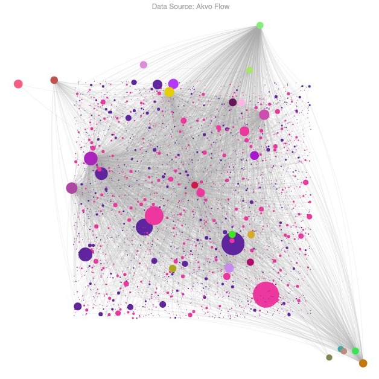

<h1>Table of Contents<span class="tocSkip"></span></h1>
<div class="toc"><ul class="toc-item"><li><span><a href="#Preparation" data-toc-modified-id="Preparation-1"><span class="toc-item-num">1&nbsp;&nbsp;</span>Preparation</a></span><ul class="toc-item"><li><span><a href="#Library-Import" data-toc-modified-id="Library-Import-1.1"><span class="toc-item-num">1.1&nbsp;&nbsp;</span>Library Import</a></span></li><li><span><a href="#Library-Setup" data-toc-modified-id="Library-Setup-1.2"><span class="toc-item-num">1.2&nbsp;&nbsp;</span>Library Setup</a></span></li></ul></li><li><span><a href="#Example-Data" data-toc-modified-id="Example-Data-2"><span class="toc-item-num">2&nbsp;&nbsp;</span>Example Data</a></span><ul class="toc-item"><li><span><a href="#Get-Data" data-toc-modified-id="Get-Data-2.1"><span class="toc-item-num">2.1&nbsp;&nbsp;</span>Get Data</a></span></li><li><span><a href="#Output-Preview" data-toc-modified-id="Output-Preview-2.2"><span class="toc-item-num">2.2&nbsp;&nbsp;</span>Output Preview</a></span></li><li><span><a href="#Data-Frame-View" data-toc-modified-id="Data-Frame-View-2.3"><span class="toc-item-num">2.3&nbsp;&nbsp;</span>Data Frame View</a></span></li></ul></li><li><span><a href="#Database-Import" data-toc-modified-id="Database-Import-3"><span class="toc-item-num">3&nbsp;&nbsp;</span>Database Import</a></span></li><li><span><a href="#Data-Cleaning" data-toc-modified-id="Data-Cleaning-4"><span class="toc-item-num">4&nbsp;&nbsp;</span>Data Cleaning</a></span><ul class="toc-item"><li><span><a href="#Column-Selection" data-toc-modified-id="Column-Selection-4.1"><span class="toc-item-num">4.1&nbsp;&nbsp;</span>Column Selection</a></span></li><li><span><a href="#Rename-Column-Header" data-toc-modified-id="Rename-Column-Header-4.2"><span class="toc-item-num">4.2&nbsp;&nbsp;</span>Rename Column Header</a></span></li><li><span><a href="#Data-Cleaning" data-toc-modified-id="Data-Cleaning-4.3"><span class="toc-item-num">4.3&nbsp;&nbsp;</span>Data Cleaning</a></span></li></ul></li><li><span><a href="#Transformations" data-toc-modified-id="Transformations-5"><span class="toc-item-num">5&nbsp;&nbsp;</span>Transformations</a></span><ul class="toc-item"><li><span><a href="#Youth-Participants" data-toc-modified-id="Youth-Participants-5.1"><span class="toc-item-num">5.1&nbsp;&nbsp;</span>Youth Participants</a></span><ul class="toc-item"><li><span><a href="#Grouping" data-toc-modified-id="Grouping-5.1.1"><span class="toc-item-num">5.1.1&nbsp;&nbsp;</span>Grouping</a></span></li><li><span><a href="#Coloring" data-toc-modified-id="Coloring-5.1.2"><span class="toc-item-num">5.1.2&nbsp;&nbsp;</span>Coloring</a></span></li><li><span><a href="#Generate-Attributes" data-toc-modified-id="Generate-Attributes-5.1.3"><span class="toc-item-num">5.1.3&nbsp;&nbsp;</span>Generate Attributes</a></span></li><li><span><a href="#Rename-Columns" data-toc-modified-id="Rename-Columns-5.1.4"><span class="toc-item-num">5.1.4&nbsp;&nbsp;</span>Rename Columns</a></span></li><li><span><a href="#Select-Columns" data-toc-modified-id="Select-Columns-5.1.5"><span class="toc-item-num">5.1.5&nbsp;&nbsp;</span>Select Columns</a></span></li><li><span><a href="#Normalize" data-toc-modified-id="Normalize-5.1.6"><span class="toc-item-num">5.1.6&nbsp;&nbsp;</span>Normalize</a></span></li><li><span><a href="#Generate-Coordinates" data-toc-modified-id="Generate-Coordinates-5.1.7"><span class="toc-item-num">5.1.7&nbsp;&nbsp;</span>Generate Coordinates</a></span></li></ul></li><li><span><a href="#Goal-Code" data-toc-modified-id="Goal-Code-5.2"><span class="toc-item-num">5.2&nbsp;&nbsp;</span>Goal Code</a></span><ul class="toc-item"><li><span><a href="#Grouping" data-toc-modified-id="Grouping-5.2.1"><span class="toc-item-num">5.2.1&nbsp;&nbsp;</span>Grouping</a></span></li><li><span><a href="#Coloring" data-toc-modified-id="Coloring-5.2.2"><span class="toc-item-num">5.2.2&nbsp;&nbsp;</span>Coloring</a></span></li><li><span><a href="#Generate-Attributes" data-toc-modified-id="Generate-Attributes-5.2.3"><span class="toc-item-num">5.2.3&nbsp;&nbsp;</span>Generate Attributes</a></span></li><li><span><a href="#Rename-Columns" data-toc-modified-id="Rename-Columns-5.2.4"><span class="toc-item-num">5.2.4&nbsp;&nbsp;</span>Rename Columns</a></span></li><li><span><a href="#Select-Columns" data-toc-modified-id="Select-Columns-5.2.5"><span class="toc-item-num">5.2.5&nbsp;&nbsp;</span>Select Columns</a></span></li><li><span><a href="#Normalize" data-toc-modified-id="Normalize-5.2.6"><span class="toc-item-num">5.2.6&nbsp;&nbsp;</span>Normalize</a></span></li><li><span><a href="#Generate-Coordinates" data-toc-modified-id="Generate-Coordinates-5.2.7"><span class="toc-item-num">5.2.7&nbsp;&nbsp;</span>Generate Coordinates</a></span></li><li><span><a href="#Offset-Coordinates" data-toc-modified-id="Offset-Coordinates-5.2.8"><span class="toc-item-num">5.2.8&nbsp;&nbsp;</span>Offset Coordinates</a></span></li></ul></li></ul></li><li><span><a href="#Conversions" data-toc-modified-id="Conversions-6"><span class="toc-item-num">6&nbsp;&nbsp;</span>Conversions</a></span><ul class="toc-item"><li><span><a href="#Create-Nodes" data-toc-modified-id="Create-Nodes-6.1"><span class="toc-item-num">6.1&nbsp;&nbsp;</span>Create Nodes</a></span></li><li><span><a href="#Create-Edges" data-toc-modified-id="Create-Edges-6.2"><span class="toc-item-num">6.2&nbsp;&nbsp;</span>Create Edges</a></span></li><li><span><a href="#Export-to-JSON" data-toc-modified-id="Export-to-JSON-6.3"><span class="toc-item-num">6.3&nbsp;&nbsp;</span>Export to JSON</a></span></li></ul></li><li><span><a href="#Overview" data-toc-modified-id="Overview-7"><span class="toc-item-num">7&nbsp;&nbsp;</span>Overview</a></span></li></ul></div>

# Preparation

## Library Import


```python
import pandas as pd
import requests as r
import numpy as np
import webcolors
import json
import time
from datetime import date, datetime
from IPython.core.interactiveshell import InteractiveShell
from IPython.display import IFrame
```

## Library Setup


```python
InteractiveShell.ast_node_interactivity = "all"
timestr = time.strftime("%Y%m%d-%H%M")
pd.options.display.max_rows = 1000
```

# Example Data

## Get Data


```python
ds = r.get('https://ecomfe.github.io/echarts-examples/public/data/asset/data/npmdepgraph.min10.json').json()
```

## Output Preview


```python
list(ds)
ds['nodes'][0]
ds['edges'][0]
```

    ['nodes', 'edges']

    {'color': '#4f19c7',
     'label': 'jquery',
     'attributes': {},
     'y': -404.26147,
     'x': -739.36383,
     'id': 'jquery',
     'size': 4.7252817}

    {'sourceID': 'jquery', 'attributes': {}, 'targetID': 'jsdom', 'size': 1}


## Data Frame View


```python
sn = pd.DataFrame(ds['nodes'])
se = pd.DataFrame(ds['edges'])
```

```python
sn.iloc[:5]
```

<div>
<table border="1" class="dataframe">
  <thead>
    <tr style="text-align: right;">
      <th></th>
      <th>attributes</th>
      <th>color</th>
      <th>id</th>
      <th>label</th>
      <th>size</th>
      <th>x</th>
      <th>y</th>
    </tr>
  </thead>
  <tbody>
    <tr>
      <th>0</th>
      <td>{}</td>
      <td>#4f19c7</td>
      <td>jquery</td>
      <td>jquery</td>
      <td>4.725282</td>
      <td>-739.36383</td>
      <td>-404.26147</td>
    </tr>
    <tr>
      <th>1</th>
      <td>{}</td>
      <td>#c71969</td>
      <td>backbone</td>
      <td>backbone</td>
      <td>6.155468</td>
      <td>-134.22150</td>
      <td>-862.75170</td>
    </tr>
    <tr>
      <th>2</th>
      <td>{}</td>
      <td>#c71969</td>
      <td>underscore</td>
      <td>underscore</td>
      <td>100.000000</td>
      <td>-75.53079</td>
      <td>-734.42210</td>
    </tr>
    <tr>
      <th>3</th>
      <td>{}</td>
      <td>#c71969</td>
      <td>faye</td>
      <td>faye</td>
      <td>0.678160</td>
      <td>-818.97516</td>
      <td>624.50604</td>
    </tr>
    <tr>
      <th>4</th>
      <td>{}</td>
      <td>#c71919</td>
      <td>socket.io</td>
      <td>socket.io</td>
      <td>19.818306</td>
      <td>-710.59204</td>
      <td>120.37976</td>
    </tr>
  </tbody>
</table>
</div>


```python
se.iloc[:5]
```

<div>
<table border="1" class="dataframe">
  <thead>
    <tr style="text-align: right;">
      <th></th>
      <th>attributes</th>
      <th>size</th>
      <th>sourceID</th>
      <th>targetID</th>
    </tr>
  </thead>
  <tbody>
    <tr>
      <th>0</th>
      <td>{}</td>
      <td>1</td>
      <td>jquery</td>
      <td>jsdom</td>
    </tr>
    <tr>
      <th>1</th>
      <td>{}</td>
      <td>1</td>
      <td>jquery</td>
      <td>xmlhttprequest</td>
    </tr>
    <tr>
      <th>2</th>
      <td>{}</td>
      <td>1</td>
      <td>jquery</td>
      <td>htmlparser</td>
    </tr>
    <tr>
      <th>3</th>
      <td>{}</td>
      <td>1</td>
      <td>jquery</td>
      <td>contextify</td>
    </tr>
    <tr>
      <th>4</th>
      <td>{}</td>
      <td>1</td>
      <td>backbone</td>
      <td>underscore</td>
    </tr>
  </tbody>
</table>
</div>


# Database Import


```python
registration = pd.read_excel('./DATA_CLEANING-35990002.xlsx', skiprows=[0])
participation = pd.read_excel('./DATA_CLEANING-44030001.xlsx', skiprows=[0])
```

# Data Cleaning

## Column Selection


```python
regs = registration[[
    'Identifier',
    '41480001|Nama Lengkap (Sesuai KTP/Kartu Pelajar)',
    '44020003|Tanggal Lahir',
    '47000004|Jenis Kelamin',
    '43440001|Alamat'
]]
pcs = participation[[
    'Identifier',
    '41480002|Daftar Kode Output-Aktifitas (Pastikan ke penyelenggara)',
    '36970009|Nama Aktifitas (lihat absensi kertas/backdrop kegiatan)',
    '40580002|Organisasi penyelenggara'
]]
```

## Rename Column Header


```python
youth_participation = pd.merge(pcs, regs, on='Identifier')
youth_participation = youth_participation.rename(columns = {
    '41480002|Daftar Kode Output-Aktifitas (Pastikan ke penyelenggara)':'Kode Output',
    '36970009|Nama Aktifitas (lihat absensi kertas/backdrop kegiatan)':'Nama Aktivitas',
    '40580002|Organisasi penyelenggara':'Organisasi Penyelenggara',
    '41480001|Nama Lengkap (Sesuai KTP/Kartu Pelajar)':'Nama Lengkap',
    '47000004|Jenis Kelamin':'Jenis Kelamin',
    '44020003|Tanggal Lahir':'DOB',
    '43440001|Alamat':'Alamat'
})
```

## Data Cleaning


```python
youth_participation['DOB'] = youth_participation['DOB'].fillna(0)
youth_participation['Provinsi'] = youth_participation['Alamat'].apply(lambda x:x.split('|')[0].replace('Prov. ',''))
youth_participation['Kota / Kab'] = youth_participation['Alamat'].apply(lambda x:x.split('|')[1])
youth_participation['Goal Code'] = youth_participation['Kode Output'].apply(lambda x: x.split('|')[3][:7])
youth_participation = youth_participation[['Identifier','Organisasi Penyelenggara','Nama Lengkap','Jenis Kelamin','Goal Code','Provinsi','Kota / Kab','DOB']]
youth_participation['Nama Lengkap'] = youth_participation['Nama Lengkap'].str.title()
youth_participation['Jenis Kelamin'] = youth_participation['Jenis Kelamin'].str.upper()
```

```python
youth_participation.iloc[:5]
```

<div>
<table border="1" class="dataframe">
  <thead>
    <tr style="text-align: right;">
      <th></th>
      <th>Identifier</th>
      <th>Organisasi Penyelenggara</th>
      <th>Nama Lengkap</th>
      <th>Jenis Kelamin</th>
      <th>Goal Code</th>
      <th>Provinsi</th>
      <th>Kota / Kab</th>
      <th>DOB</th>
    </tr>
  </thead>
  <tbody>
    <tr>
      <th>0</th>
      <td>cjxm-dhfw-98yx</td>
      <td>Oxfam</td>
      <td>Waode Hesni Hidayat</td>
      <td>PEREMPUAN</td>
      <td>3.1.1.1</td>
      <td>Sulawesi Tenggara</td>
      <td>Kota Baubau</td>
      <td>2002-09-05</td>
    </tr>
    <tr>
      <th>1</th>
      <td>hm4y-ma9d-3hue</td>
      <td>Oxfam</td>
      <td>Hayuna Rabiyatun</td>
      <td>PEREMPUAN</td>
      <td>3.1.1.1</td>
      <td>Sulawesi Tenggara</td>
      <td>Kota Baubau</td>
      <td>2002-06-01</td>
    </tr>
    <tr>
      <th>2</th>
      <td>97q1-xx5u-1efs</td>
      <td>Oxfam</td>
      <td>Resty Nur Amalia</td>
      <td>PEREMPUAN</td>
      <td>3.1.1.1</td>
      <td>Sulawesi Tenggara</td>
      <td>Kota Baubau</td>
      <td>2002-10-13</td>
    </tr>
    <tr>
      <th>3</th>
      <td>3mwx-jfqk-0vxh</td>
      <td>Oxfam</td>
      <td>Hartin</td>
      <td>PEREMPUAN</td>
      <td>3.1.1.1</td>
      <td>Sulawesi Tenggara</td>
      <td>Kota Baubau</td>
      <td>2000-04-15</td>
    </tr>
    <tr>
      <th>4</th>
      <td>s68e-ucka-y7gf</td>
      <td>Oxfam</td>
      <td>Diva Syahdani</td>
      <td>PEREMPUAN</td>
      <td>3.1.1.1</td>
      <td>Sulawesi Tenggara</td>
      <td>Kota Baubau</td>
      <td>2000-11-14</td>
    </tr>
  </tbody>
</table>
</div>


# Transformations

## Youth Participants

### Grouping


```python
youth_size = youth_participation.groupby(['Identifier','Nama Lengkap','Jenis Kelamin','Kota / Kab','Provinsi','DOB']).size().to_frame('size').reset_index()
```

### Coloring


```python
youth_size['color'] = youth_size['Jenis Kelamin'].apply(lambda x: '#5f259f' if x == 'LAKI-LAKI' else '#ed379e')
```

### Generate Attributes


```python
def calculateAge(born):
    if born == 0:
        return None
    born = datetime.strptime(born, "%Y-%m-%d").date()
    today = date.today()
    age = today.year - born.year - ((today.month, today.day) < (born.month, born.day))
    return age

youth_size['attributes'] = youth_size.apply(lambda row: {
    'Jenis Kelamin': 'L' if row['Jenis Kelamin'] == 'LAKI-LAKI' else 'P',
    'Kota / Kab': row['Kota / Kab'],
    'Provinsi': row['Provinsi'],
    'Umur': calculateAge(row['DOB'])
},axis=1)
```

### Rename Columns


```python
youth_size = youth_size.rename(columns={
    'Identifier':'id',
    'Nama Lengkap':'label'
})
```

### Select Columns


```python
youth_size = youth_size[['attributes','color','id','label','size']]
```

### Normalize


```python
youth_size.sort_values(by=['size'])[:1]['size']
youth_size.sort_values(by=['size']).tail(1)['size']
```

    2098    1
    Name: size, dtype: int64

    202    43
    Name: size, dtype: int64


```python
#youth_size['size'] = youth_size['size'].apply(lambda x: x + 10 if x < 10 else x)
#youth_size['size'] = youth_size['size'] / 2
```

```python
youth_size.sort_values(by=['size'])[:1]['size']
youth_size.sort_values(by=['size']).tail(1)['size']
```

    2098    1
    Name: size, dtype: int64

    202    43
    Name: size, dtype: int64


### Generate Coordinates


```python
youth_size['x'] = np.random.uniform(-100,100,size=len(youth_size))
youth_size['y'] = np.random.uniform(-100,100,size=len(youth_size))
```

## Goal Code

### Grouping


```python
goal_size = youth_participation.groupby(['Goal Code']).size().to_frame('size').reset_index()
```

### Coloring

_Using Library_ : **webcolors**

```python
def randomCol():
    hexcol = webcolors.rgb_to_hex(list(np.random.choice(range(256), size=3)))
    return hexcol

goal_size['color'] = goal_size['size'].apply(lambda x: randomCol())
```

### Generate Attributes


```python
goal_size['attributes'] = goal_size.apply(lambda row: {},axis=1)
```

### Rename Columns


```python
goal_size = goal_size.rename(columns={
    'Goal Code':'id',
})
```

### Select Columns


```python
goal_size['label'] = goal_size['id']
goal_size = goal_size[['attributes','color','id','label','size']]
```

### Normalize

*Actual Value*

```python
goal_size.sort_values(by=['size'])[:1]['size']
goal_size.sort_values(by=['size']).tail(1)['size']
```

    21    1
    Name: size, dtype: int64

    0    984
    Name: size, dtype: int64


```python
goal_size['size'] = goal_size['size'].apply(lambda x: x*100 / goal_size['size'].sum())
goal_size['size'] = goal_size['size'].apply(lambda x: x*100 if x < 0.1 else x)
goal_size['size'] = goal_size['size'].apply(lambda x: x + 10 if x < 10 else x)
```

```python
goal_size.sort_values(by=['size'])[:1]['size']
goal_size.sort_values(by=['size']).tail(1)['size']
```

    8    10.183528
    Name: size, dtype: float64

    0    22.573985
    Name: size, dtype: float64

### Generate Coordinates

```python
goal_size['x'] = np.random.uniform(-150,150,size=len(goal_size))
goal_size['y'] = np.random.uniform(-150,150,size=len(goal_size))
```

### Offset Coordinates

```python
goal_size['x'] = goal_size.apply(lambda r: np.random.uniform(-150,-100) if -100 > r['x'] else r['x'], axis=1)
goal_size['x'] = goal_size.apply(lambda r: np.random.uniform(100,150) if 100 < r['y'] else r['x'], axis=1)
goal_size['y'] = goal_size.apply(lambda r: np.random.uniform(-150,-100) if -100 > r['y'] else r['y'], axis=1)
goal_size['y'] = goal_size.apply(lambda r: np.random.uniform(100,150) if 100 < r['x'] else r['y'], axis=1)
```

# Conversions

## Create Nodes

Nodes are goal codes and youth participations rows
Both rows defined as individual data that has coordinate (position) and value (point size)

```python
nodes = youth_size.append(goal_size)
nodes = nodes.to_dict('record')
```

```python
nodes[0]
```

    {'attributes': {'Jenis Kelamin': 'L',
      'Kota / Kab': 'Kab. Maros',
      'Provinsi': 'Sulawesi Selatan',
      'Umur': 19},
     'color': '#5f259f',
     'id': '10df-8mv3-qq36',
     'label': 'Ariyanda',
     'size': 2.0,
     'x': -36.21170475918192,
     'y': 20.51688961747722}

## Create Edges

- Edges defines the relationship between both dataframe
- How many times an individual youth attend the activities

```python
edges = youth_participation.rename(columns={
    'Identifier':'sourceID',
    'Goal Code':'targetID',
})[['sourceID','targetID']]
edges['attributes'] = edges.apply(lambda x: {},axis=1)
edges['size'] = 1
edges = edges.to_dict('record')
```

```python
edges[0]
```
    {'sourceID': 'cjxm-dhfw-98yx',
     'targetID': '3.1.1.1',
     'attributes': {},
     'size': 1}

## Export to JSON

This data will directly exported to distribution folder for the website view


```python
output = {"nodes":nodes,"edges":edges}
with open('../dist/output-table.json', 'w') as fp:
    json.dump(output, fp)
```

# Overview


```python
IFrame('http://localhost:3000', width=850, height=700)
```
[](https://akvo.org)
